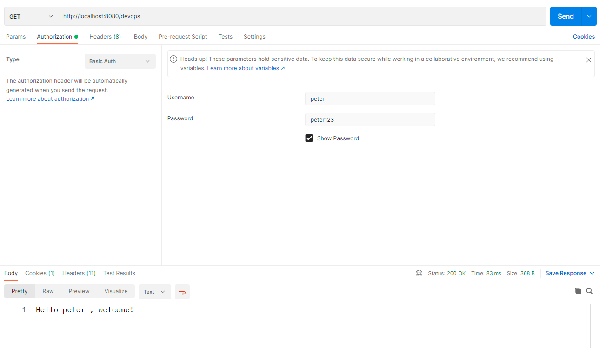

# In memory security 

There are 2 aspects for authentication 
 * Authentication 
    * identify user using credentails, if failed returns Http code 401 
 * Authorization 
   * identify user has access to resources , if failed returns Http code 403


#### class responsible to configure authentication 
 * WebSecurityConfigurerAdapter

following method used to authenticate 
````````````````````````
 @Override
    protected void configure(AuthenticationManagerBuilder auth) throws Exception {
        //super.configure(auth);
    }
````````````````````````
following method used to authorization
````````````````````````
@Override
    protected void configure(HttpSecurity http) throws Exception {
        super.configure(http);
    }
````````````````````````

### steps to configure security 
 * create new class extending WebSecurityConfigurerAdapter
 * configure authentication (credentails) using following method
````````````````````````
 @Override
    protected void configure(AuthenticationManagerBuilder auth) throws Exception {
        //super.configure(auth);
    }
````````````````````````
 * configure authorization (which user access to which resource)
````````````````````````
@Override
    protected void configure(HttpSecurity http) throws Exception {
        super.configure(http);
    }
````````````````````````
 * Finally declare a bean for password encoder
````````````````````````
    @Bean
    public BCryptPasswordEncoder encoder(){
        return new BCryptPasswordEncoder();
    }
````````````````````````

if we need to access user account details, we can use below code snippet
from the controllers
````````````````````````

    @GetMapping
    public String sayGreetings(){
        User user = (User) SecurityContextHolder.getContext().getAuthentication().getPrincipal();
        return "Hello "+ user.getUsername() + " , welcome!";
    }
````````````````````````


### class references

````````````````````````

@Configuration
public class AuthConfig extends WebSecurityConfigurerAdapter {

    private static final String DEVELOPER_AUTHORITY = "developer";
    private static final String DEVOPS_AUTHORITY = "devops";


    @Override
    protected void configure(AuthenticationManagerBuilder auth) throws Exception {

        auth.inMemoryAuthentication()
                .withUser("jim")
                .password("$2a$10$KmK9TbNee7haKdIzctS6jOxYaAMgSx6jknRt7BsmmFWDhxERz3/rq")//("jim123")
                .authorities(DEVELOPER_AUTHORITY)
                .and()
                .withUser("peter")
                .password("$2a$10$J6TKtJWW6uZ3oFo/W/OFnu.11F4tkfqtFRUjS1PmCztHaLYQw91Nq")//("peter123")
                .authorities(DEVOPS_AUTHORITY)
                .and()
                .withUser("catalina")
                .password("$2a$10$54R/0iWJoNLifcifEhZOOukzrvUnbzDXca0aUbyKL91zyDMiulzf.")//("catalina123")
                .authorities(DEVOPS_AUTHORITY,DEVELOPER_AUTHORITY);


    }

    @Override
    protected void configure(HttpSecurity http) throws Exception {
       http.httpBasic()
               .and()
               .authorizeHttpRequests()
               .antMatchers("/developer/**").hasAnyAuthority(DEVELOPER_AUTHORITY)
               .antMatchers("/devops/**").hasAnyAuthority(DEVOPS_AUTHORITY)
               .antMatchers("/**").permitAll()
               .and()
               .formLogin();
    }

    @Bean
    public BCryptPasswordEncoder encoder(){
        return new BCryptPasswordEncoder();
    }
}
````````````````````````

As per above configuration 
 * jim can access /developer/** (jim, jim123)
 * peter can access /devops/** (peter, peter123)
 * cataina can  access both /developer/** and /devops/** (catalina, catalina123)
 * finally /guest/** accessible by anyone 




